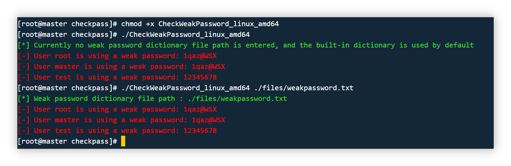

# 🎯 Detecting weak passwords in Linux by checking the shadow file

- 🎉 Currently only MD5, SHA-256, SHA-512 hash algorithm format passwords can be detected.

- 🪄 The weak password dictionary path can be customized. If a weak password dictionary file is not specified, the built-in dictionary will be used.

- 🎲 The result is as follows: 

